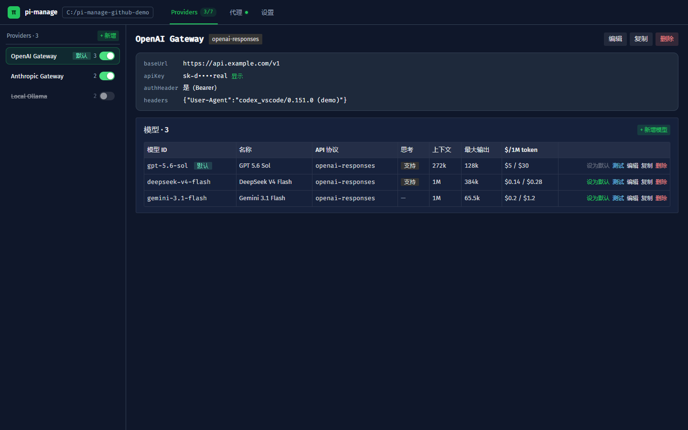
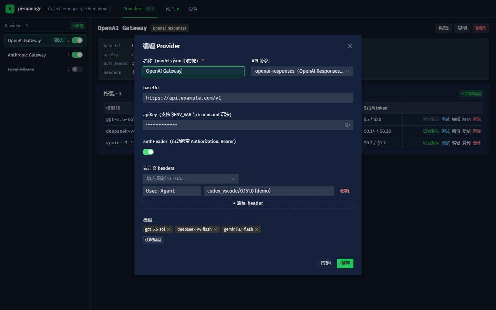
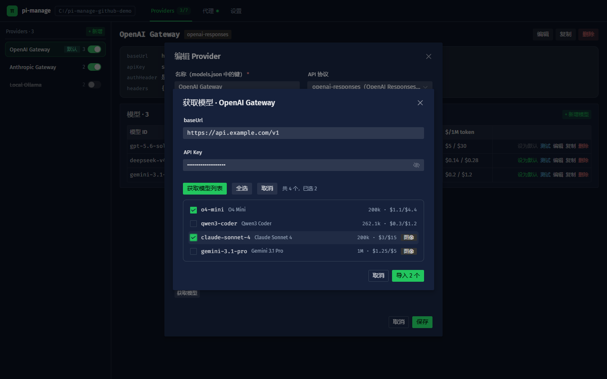
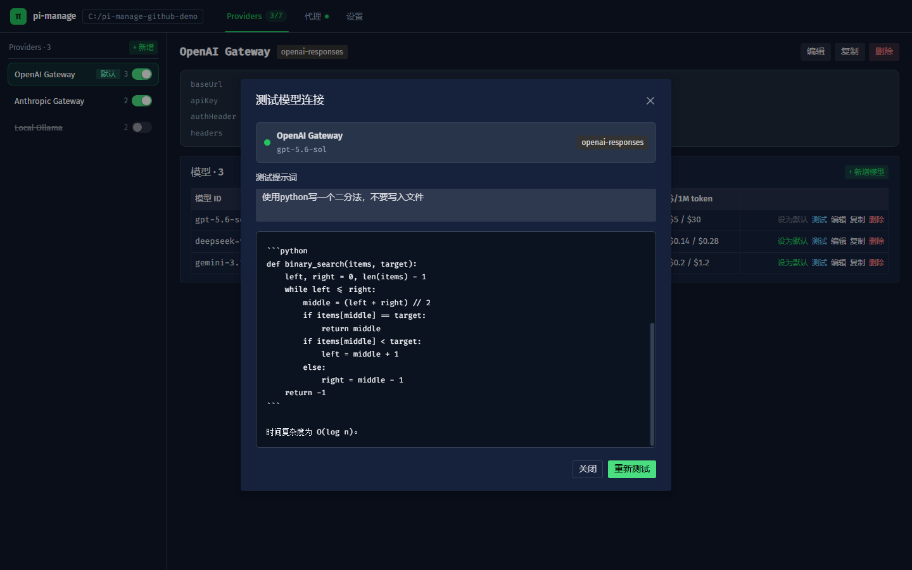
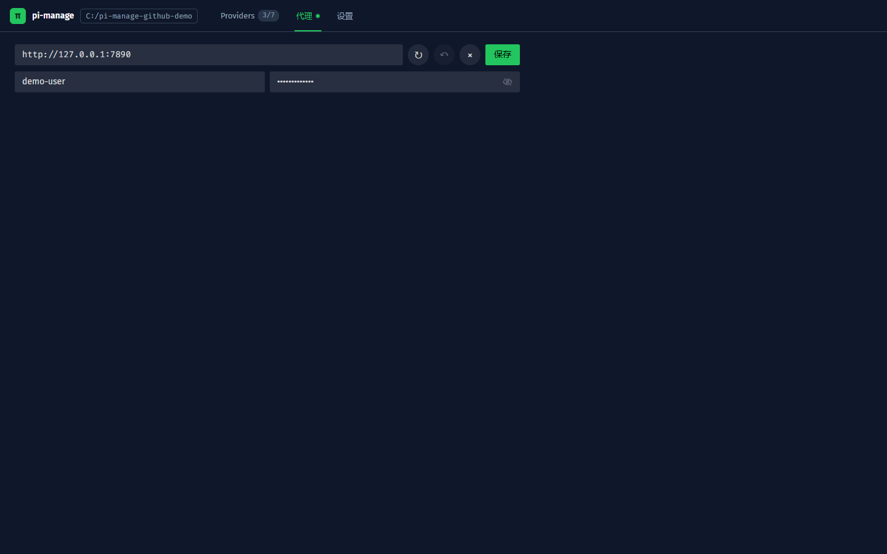
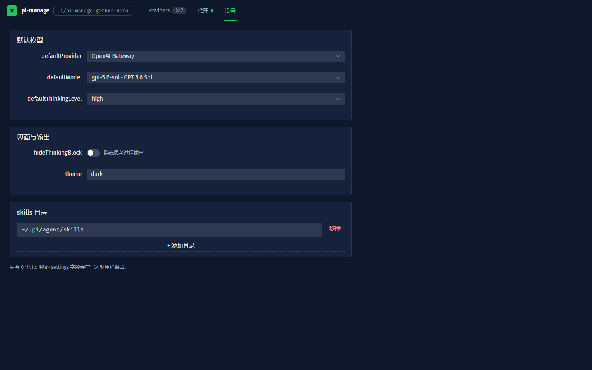

# pi-manage

管理 pi 的 Provider、模型、默认模型和 CLI User-Agent。

## 安装与启动

```bash
npm install -g pi-manage
pi-manage
```

默认打开 `http://127.0.0.1:8787`，也可以：

```bash
pi-manage --port 9000
pi-manage --no-open
```

## 功能

- 管理 Provider 和模型，支持新增、编辑、复制、删除、启用和禁用。
- 自动保存 Provider、模型和 settings 修改。
- 从 OpenAI、Anthropic、Google 模型接口获取模型并批量导入。
- 使用 models.dev 补全模型上下文、价格、图像输入和推理信息。
- 测试模型连接，支持自定义提示词和完整回复。
- 配置 HTTP/mixed 或 SOCKS5 代理，可选用户名和密码。
- 一键填入最新的 codex / claude-cli User-Agent。
- 管理默认模型、思考档位、主题和 skills 目录。

### 获取模型

- OpenAI 协议先请求 `/models`，失败或返回空结果时自动尝试 `/v1/models`。
- Anthropic 协议请求 `/v1/models`。
- Google 协议请求 `/models`。
- API Key 必须与当前 Provider 和协议匹配。

代理也可以通过环境变量配置：

```text
PI_MANAGE_PROXY
PI_MANAGE_PROXY_USERNAME
PI_MANAGE_PROXY_PASSWORD
```

## 界面预览

截图使用隔离的演示配置，不包含真实 API Key。

<table>
  <tr>
    <td></td>
    <td></td>
  </tr>
  <tr>
    <td></td>
    <td></td>
  </tr>
  <tr>
    <td></td>
    <td></td>
  </tr>
</table>

## 本地开发

```bash
npm install
npm run dev
npm run dev:back
npm run dev:back:run
npm run build
```

`npm run dev` 启动前端开发服务；后端开发服务使用 `dev:back` 和 `dev:back:run`。

## 数据位置

| 文件 | 用途 |
|------|------|
| `~/.pi/agent/models.json` | pi 实际读取的已启用 Provider |
| `~/.pi/agent/settings.json` | 默认模型、主题和 skills 等设置 |
| `~/.pi/agent/.pi-manage/providers.json` | Provider 和模型完整本地库 |
| `~/.pi/agent/.pi-manage/config.json` | pi-manage 的代理配置 |

可用 `PI_CODING_AGENT_DIR` 修改默认的 `~/.pi/agent` 目录。

## 安全

服务只监听本机 `127.0.0.1`，但没有用户认证；同一台机器上的其他本地进程可以访问它。API Key 和代理密码会保存在本机配置文件中，请勿在不受信任的共享环境中运行。
