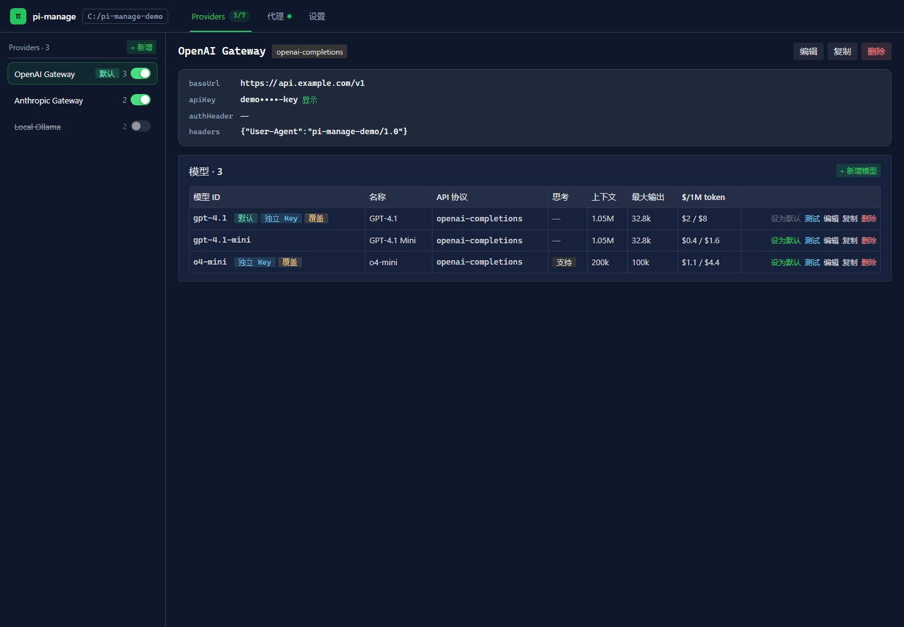
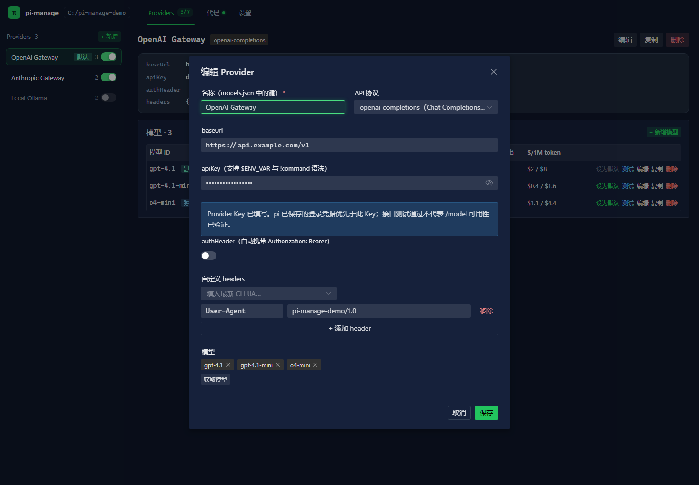
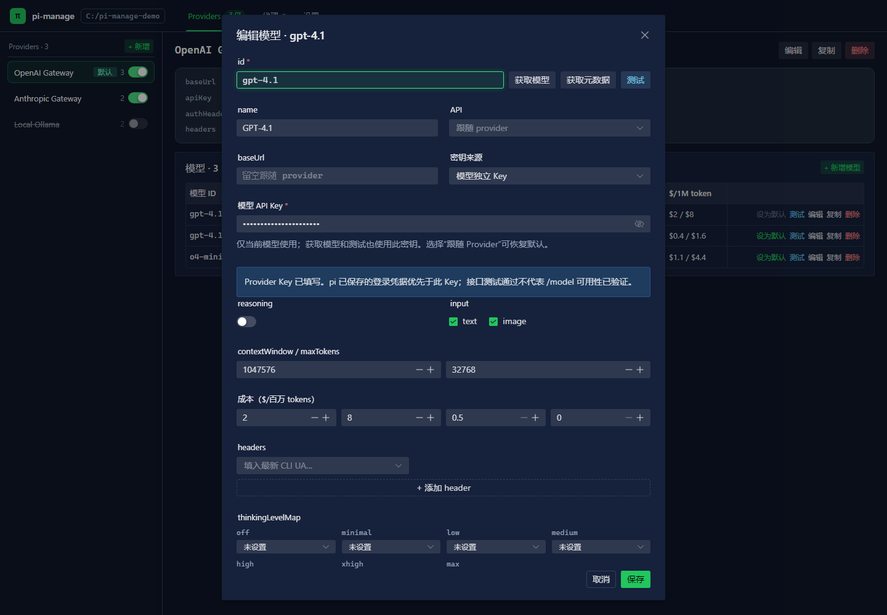
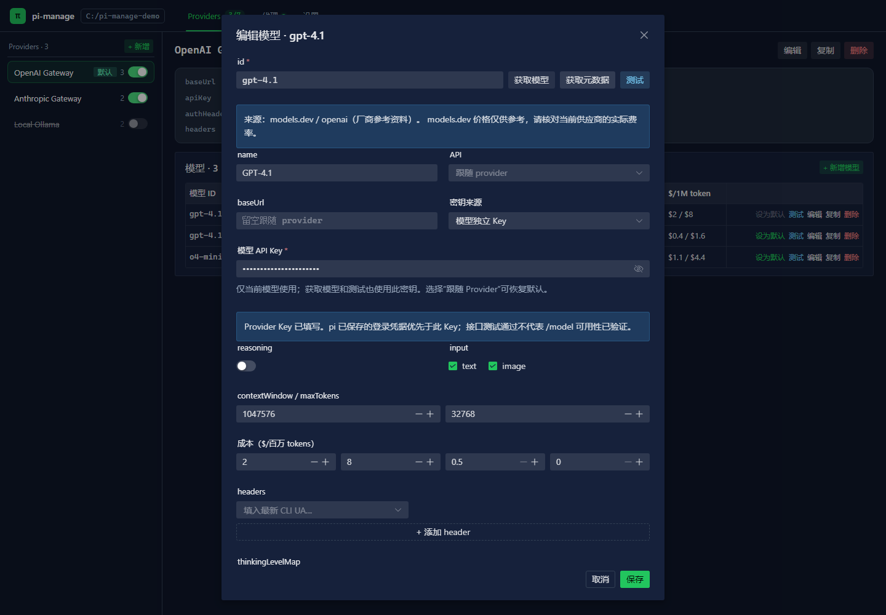
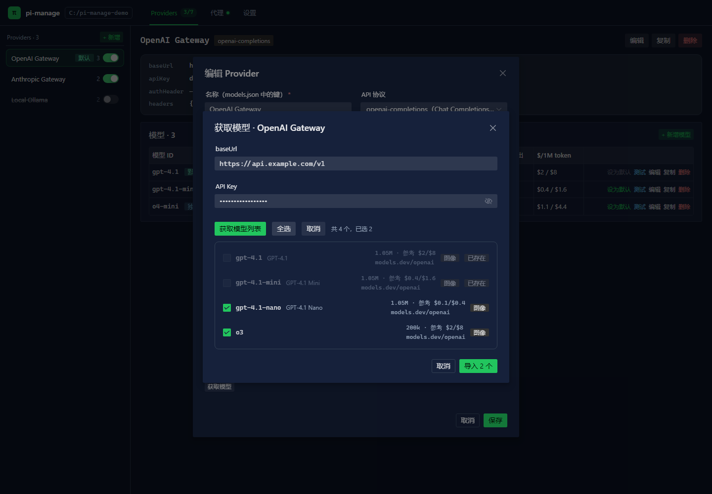
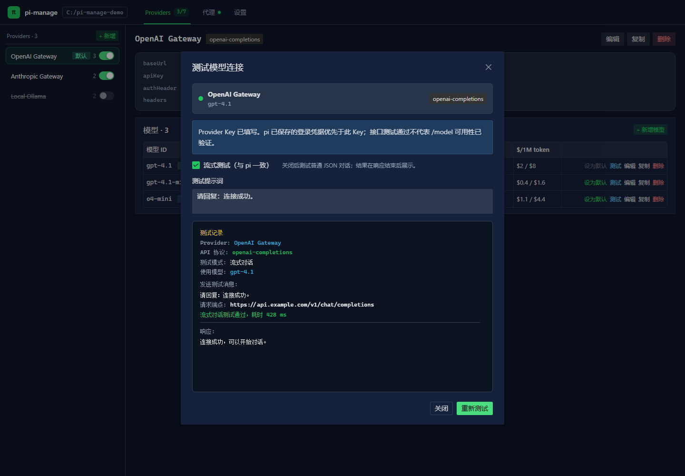
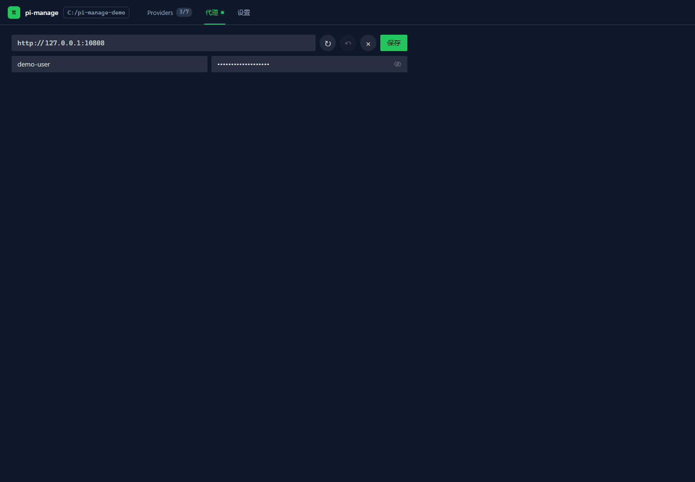
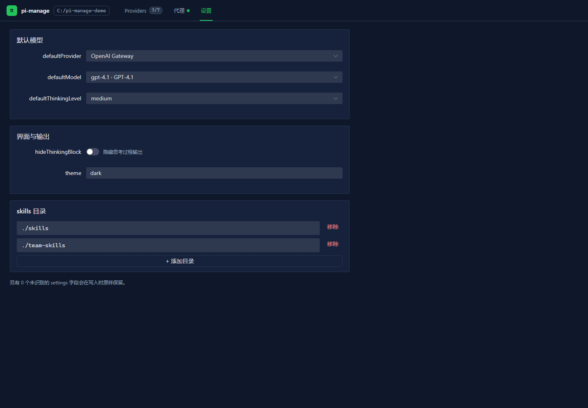

# pi-manage

管理 pi 的 Provider、模型、默认模型和 CLI User-Agent。

## 安装与启动

需要 Node.js 22+；作为 pi 扩展使用时，还需先安装 pi。

### 独立启动

```bash
npm install -g pi-manage
pi-manage
```

默认打开 `http://127.0.0.1:8787`，也可以：

```bash
pi-manage --port 9000
pi-manage --no-open
```

### 在 pi 中作为扩展使用

#### 从 npm 安装

从 `0.2.0` 起，npm 包包含 pi 扩展和构建产物，其他电脑可直接安装：

```bash
pi install npm:pi-manage
pi
```

如果 pi 已经在运行，安装后重启 pi 或执行 `/reload`，再输入 `/pi-manage` 打开管理页。

已通过 `pi install` 安装过扩展的用户，可在终端执行 `pi update --extensions`，再回到 pi 执行 `/reload`。

npm 包会包含网页、后台和扩展入口，构建在发布时由发布者或 CI 完成。通过 npm 安装的电脑无需克隆源码，也无需执行 `npm run build`。

#### 从本地源码试用

使用本地源码时，需要先在项目目录安装依赖并构建，再让 pi 单次加载扩展：

```bash
npm install
npm run build
pi -e ./extensions/pi-manage.js
```

`pi -e` 不写入 pi 的包设置。如需长期启用，可运行 `pi install "<项目绝对路径>"` 注册本地包，再重启 pi 或执行 `/reload`。

#### 扩展命令与生命周期

在 pi 输入：

| 命令 | 行为 |
|------|------|
| `/pi-manage` 或 `/pi-manage open` | 启动后台并用默认浏览器打开管理页 |
| `/pi-manage start` | 仅启动后台并显示地址，适合没有图形浏览器的环境 |
| `/pi-manage status` | 查看启动状态和访问地址 |
| `/pi-manage stop` | 停止本次后台，之后可以重新启动 |

```text
pi -> /pi-manage -> 本次会话的后台 -> 浏览器管理页
 |                        |
 +-- 退出或重载 ---------> 自动停止
```

- 扩展加载时只注册命令；首次执行启动命令才创建后台。同一扩展重复启动会复用现有实例。
- 每个 pi 实例使用独立的空闲端口，只监听 `127.0.0.1`；访问地址以命令提示为准。
- 退出 pi、执行 `/reload`，以及新建、恢复或分叉会话时，会清理原会话的后台；需要时重新执行 `/pi-manage`。
- pi 父进程异常退出时，后台检测到 IPC 通道断开后自行退出。扩展只停止自己创建的子进程。
- 后台继承 pi 的工作目录和环境变量，继续使用相同的 `PI_CODING_AGENT_DIR`。独立运行的 `pi-manage` 命令仍由 Ctrl+C 停止。
- 使用 pi 独立可执行文件时，PATH 中也需有 Node.js 22+。浏览器无法自动打开时，可以访问提示的地址。

扩展使用 `dist/` 和 `dist-server/` 构建产物；源码修改后需重新构建。缺少产物时会明确提示，不会自动安装依赖或启动开发服务。

## 功能

- 作为 pi 扩展通过 `/pi-manage` 打开管理页，退出 pi 后自动关闭本次后台，也支持独立启动。
- 管理 Provider 和模型，支持新增、编辑、复制、删除、启用和禁用。
- 为模型单独配置 API Key，适配同一中转站不同模型使用不同密钥的场景。
- 自动保存 Provider、模型和 settings 修改。
- 从 OpenAI、Anthropic、Google 模型接口获取模型并批量导入。
- 使用 models.dev 补全模型上下文、价格、图像输入和推理信息。
- 测试模型连接，支持自定义提示词、流式/普通对话和完整回复。
- 配置 HTTP/mixed 或 SOCKS5 代理，可选用户名和密码。
- 一键填入最新的 codex / claude-cli User-Agent。
- 管理默认模型、思考档位、主题和 skills 目录。

### 自动保存与外部修改

- 最后一次编辑后静置 800ms 自动保存；保存期间继续编辑的内容会进入下一次保存。
- 保存失败会保留页面编辑，等待修正内容或点击重试，不会持续重复提交。
- 发现外部新增、移除或修改 Provider 时，先逐项选择采用外部配置或保留本地配置，再恢复自动保存。
- 页面打开后，其他工具或页面修改了 Provider 库或 `models.json`，保存会被拒绝并提示重新加载；重新加载前会确认是否放弃尚未保存的编辑。
- `settings.json` 继续按字段合并：页面未改动的字段保留磁盘上的外部变更。
- 在模型列表或 Provider 表单中移除当前默认的本地模型，都会同步清理 `defaultModel`；原本不在本地列表中的 pi 内置模型引用继续保留。

写入前会准备三个配置文件的新内容与原始备份。文件替换失败时恢复已替换的文件；若恢复也失败，后端错误会给出保留的 `.bak-*` 备份路径。此机制处理运行中的写入异常，不保证强制结束进程或断电时三个文件同时提交。

### 配置格式与校验

- 对照 pi 0.87.1，`models.json` 可包含 `//` 行注释、尾逗号和 UTF-8 BOM；不支持块注释。`settings.json` 支持 BOM，仍使用严格 JSON。
- 保存时输出标准 JSON，保留配置字段，但不保留注释和原始排版。
- 保存前检查模型上限、Header 类型、思考档位、图片限制、缓存时长、兼容参数及 `modelOverrides` 结构；错误包含 Provider、模型和字段位置。
- `contextWindow` / `maxTokens` 必须大于 0，使用默认值请留空。`modelOverrides.cost` 允许只填写部分费率。
- API 和地址允许由 pi 内置模型或扩展提供，因此省略值不会一律阻止保存；表单会提示该继承依赖。自定义中转模型需显式配置，测试时也必须提供本工具可用的协议和地址。

### 对话测试

- 默认请求流式对话，检查协议响应和正常结束事件；可关闭“流式测试”排查普通 JSON 对话。回复在响应结束后展示。
- 关闭测试弹窗会同步中止后端上游请求；已经完成的生成仍以供应商计费规则为准。
- 测试采用 Provider、模型和 `modelOverrides` 的兼容设置，包括 Chat 的输出上限字段、流式用量、`store` 以及 Responses 的输出上限开关。
- 按 pi 0.87.1 行为，模型 `samplingParams` 用于 OpenAI 系列；Anthropic / Google 适配器不读取此字段。Anthropic 测试端点携带 pi SDK 使用的 `beta=true`。
- HTML 页面、无效响应、HTTP 200 中的网关错误和提前结束的流均显示失败；耗时覆盖整个响应读取过程。
- 测试限制输出额度不超过 2048 token，并采用模型更低的上限（Responses 协议最少 16 token）。覆盖测试模型、提示词、模式或超出额度的采样参数会明确报错。
- 接口测试使用当前配置，不读取 pi 的 `auth.json`，验证范围为接口请求与响应，不包含工具调用或完整会话。

### 获取模型

- OpenAI 协议先请求 `/models`，失败或返回空结果时自动尝试 `/v1/models`。
- Anthropic 协议请求 `/v1/models`，按 `has_more` / `last_id` 翻页。
- Google 协议请求 `/models`，按 `nextPageToken` 翻页，支持跨页去重。
- 分页中途失败、游标异常或超过 1000 页时明确报错，不提供不完整列表供导入。
- Google 的 `baseUrl` 应包含版本路径，例如 `https://generativelanguage.googleapis.com/v1beta`，获取和测试均使用该完整地址。
- API Key 必须与当前 Provider 和协议匹配。
- models.dev 优先按连接地址匹配供应商及协议；无法确认供应商时，只采用唯一匹配的厂商参考资料，不从其他中转站拼接价格或思考档位。只有供应商和协议均匹配时才自动补全思考档位。
- 导入和元数据表单显示资料来源，models.dev 价格为参考价，网关返回的参数优先。来源提示仅用于本工具界面，不写入 pi 模型配置。
- 修改模型 ID、连接或关闭表单会取消元数据回填；元数据服务不可用会与未收录区分。导入仍保留已获取的网关信息，后端记录补全失败的原因。

### 模型独立 API Key

- 新增或编辑模型时，将“密钥来源”切换为“模型独立 Key”，填写对应中转分组的密钥。支持直接填写和 `$ENV_VAR` / `${ENV_VAR}` 引用。
- 默认选择“跟随 Provider”；恢复该选项会移除由独立 Key 生成的模型认证覆盖，不修改 Provider 默认密钥。
- 修改 Provider 的协议或 Bearer 设置时，已识别为独立 Key 的模型会同步调整认证头，继续使用各自的密钥。
- 模型表单中的“获取模型”和“测试”均使用当前未保存的协议、地址与密钥。获取弹窗固定这些连接信息，返回模型表单即可修改。
- 在 Provider 的获取模型弹窗中临时更换密钥或地址，导入时会绑定到本次导入的模型，不影响其他模型。
- 已有认证 Header 无法无损识别为独立 Key 时，保留在“自定义 Header”模式；切换来源前需先处理冲突。`!command` 可继续在高级 headers 中返回完整认证值。
- 密钥引用缺失、为空或执行失败会明确报错，不会静默改用另一分组的密钥。模型列表标记“独立 Key”或“自定义认证”，认证 Header 在列表和提示中脱敏。

独立密钥使用 pi 原生的模型 `headers` 保存，不增加 pi 不支持的模型 `apiKey` 字段。Provider 仍需具备可用的默认密钥或登录认证，才能通过 pi 的 Provider 可用性检查；模型独立 Key 覆盖实际请求的认证信息。

代理也可以通过环境变量配置：

```text
PI_MANAGE_PROXY
PI_MANAGE_PROXY_USERNAME
PI_MANAGE_PROXY_PASSWORD
```

## 界面预览

截图来自当前网页界面，使用隔离的演示配置和模拟接口响应，不包含真实 API Key。模型参数、价格和测试结果仅用于展示界面。

<table>
  <tr>
    <td><strong>Provider 与模型管理</strong><br></td>
    <td><strong>Provider 配置</strong><br></td>
  </tr>
  <tr>
    <td><strong>模型独立 API Key</strong><br></td>
    <td><strong>元数据来源与参考价</strong><br></td>
  </tr>
  <tr>
    <td><strong>模型获取与批量导入</strong><br></td>
    <td><strong>流式对话测试</strong><br></td>
  </tr>
  <tr>
    <td><strong>代理配置</strong><br></td>
    <td><strong>系统设置</strong><br></td>
  </tr>
</table>

## 本地开发

```bash
npm install
npm run dev
npm run dev:back
npm run dev:back:run
npm run build
```

`npm run dev` 启动前端开发服务；后端开发服务使用 `dev:back` 和 `dev:back:run`。

定向回归验证使用 Node 内置测试工具和项目已有的 TypeScript（Node 22.15+），测试配置放在临时目录：

```bash
node --import ./scripts/register-typescript.mjs --test scripts/config.test.mjs scripts/http.test.mjs
node --import ./scripts/register-typescript.mjs --test scripts/store.test.mjs scripts/proxy.test.mjs
node --import ./scripts/register-typescript.mjs --test scripts/model-auth.test.mjs scripts/model-requests.test.mjs
node --import ./scripts/register-typescript.mjs --test scripts/models-dev.test.mjs scripts/model-import.test.mjs
node --test scripts/pi-extension.test.mjs
node scripts/check-sfc.mjs src/components/AppShell.vue
```

插件测试只编译后台入口及其必要依赖到临时目录，使用隔离配置和静态页面夹具，验证真实 HTTP、IPC 和子进程的启动、重启、会话关闭及父进程异常退出；不会执行全项目构建或打开真实浏览器。

已安装 pi 时，可额外用官方加载器检查扩展，并对照 SDK 的模型独立密钥、端点和关键请求参数（参数为 pi 的安装目录；扩展发现使用临时目录，模型请求在进程内拦截，不读取真实用户配置）：

```bash
node scripts/check-pi-extension.mjs <pi-coding-agent安装目录>
node --import ./scripts/register-typescript.mjs scripts/check-pi-model-auth.mjs <pi-coding-agent安装目录>
node --import ./scripts/register-typescript.mjs scripts/check-pi-model-requests.mjs <pi-coding-agent安装目录>
```

API 调用方应先读取 `GET /api/config`，保存时向 `POST /api/save` 提交返回的 `revision`。版本冲突返回 `ok: false` 和 `conflict: true`，需要重新加载后处理差异，不能沿用旧版本重试。

创建与 `package.json` 版本一致的 `v*` Tag 并推送后，GitHub Actions 会自动构建并发布到 npm。

发布新功能前需更新包版本及锁文件，npm 上已发布的版本不能重复发布。发布流程通过 `prepublishOnly` 执行构建，将 `dist/`、`dist-server/` 和 `extensions/` 一并打包，供其他电脑直接通过 `pi install npm:pi-manage` 安装。

## 数据位置

| 文件 | 用途 |
|------|------|
| `~/.pi/agent/models.json` | pi 实际读取的已启用 Provider |
| `~/.pi/agent/settings.json` | 默认模型、主题和 skills 等设置 |
| `~/.pi/agent/.pi-manage/providers.json` | Provider 和模型完整本地库 |
| `~/.pi/agent/.pi-manage/config.json` | pi-manage 的代理配置 |

可用 `PI_CODING_AGENT_DIR` 修改默认的 `~/.pi/agent` 目录。

## 安全

服务只监听本机 `127.0.0.1`，拒绝浏览器跨来源访问，POST 接口只接受 `application/json`。开发时 Vite 仅转换发给自身的同源 Origin，其他来源仍交给后端拒绝。

服务没有本地用户认证，同一台机器上的其他本地进程仍可访问它。模型测试会以启动服务的用户权限执行配置中的 `!command`，请只使用可信配置。API Key 和代理密码会保存在本机配置文件中，请勿在不受信任的共享环境中运行。
